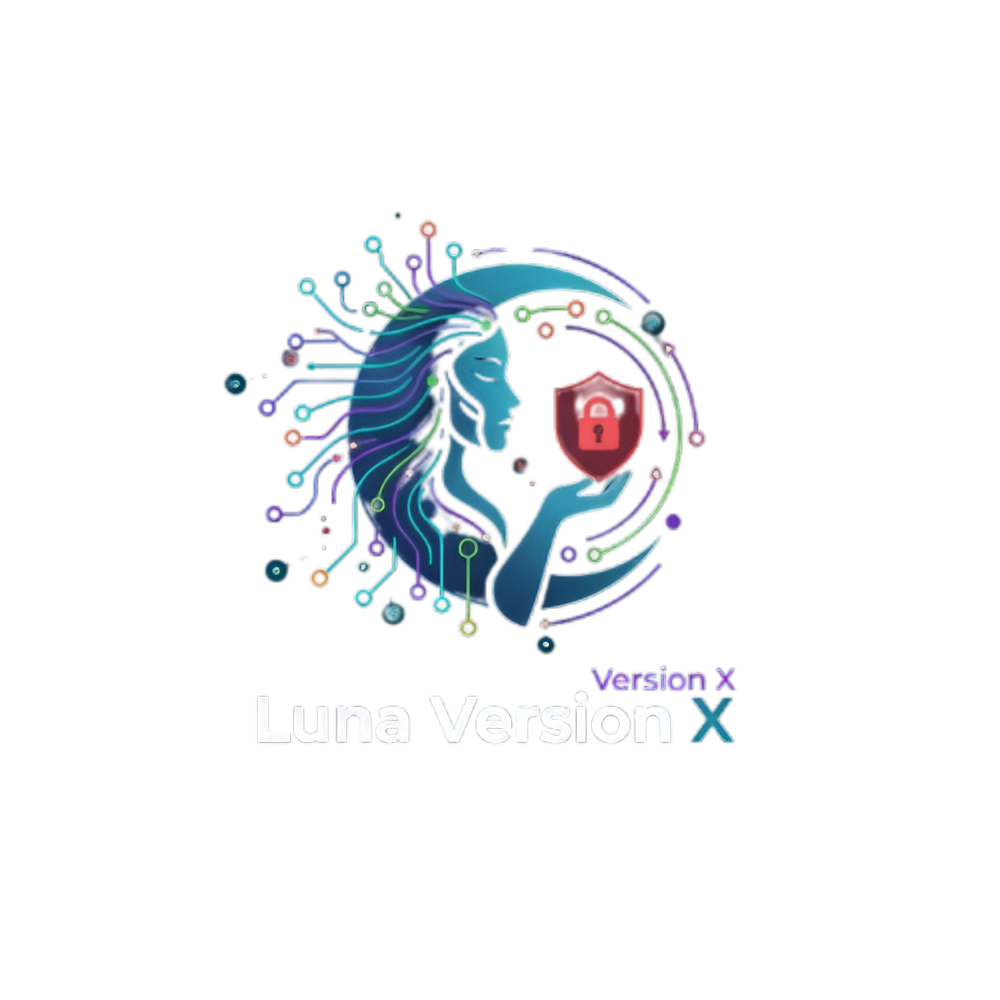
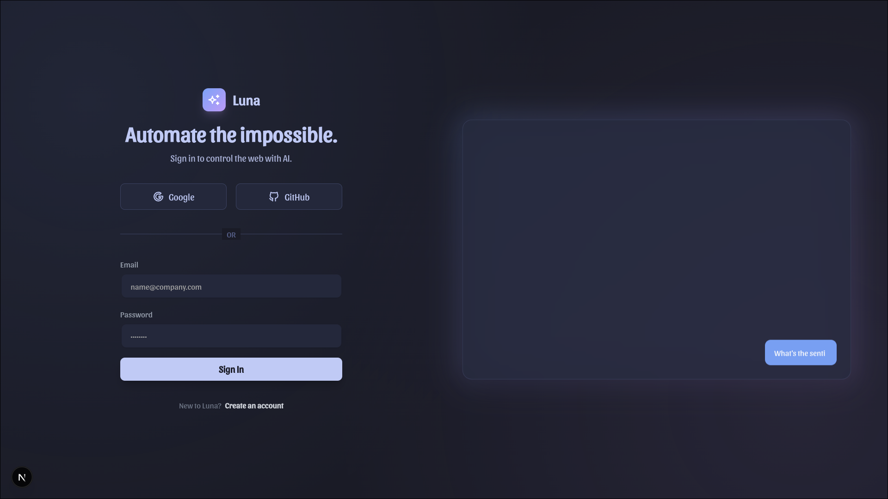
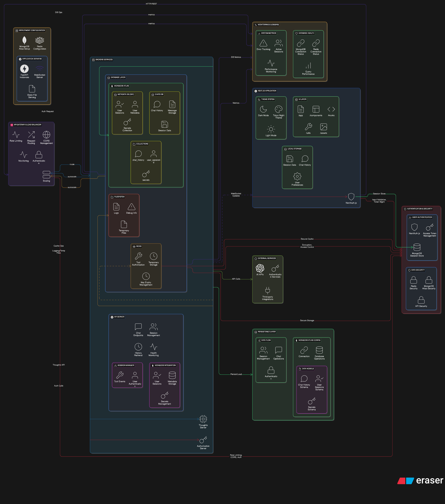

<div align="center">
    
    <br><br>
    <a href="https://github.com/Terminal127/luna-version-x/commits">
        
    </a>
    <a href="https://github.com/Terminal127/luna-version-x/stargazers">
        
    </a>
    <a href="https://github.com/Terminal127/luna-version-x">
        
    </a>
    <a href="https://github.com/Terminal127/luna-version-x/blob/master/LICENSE">
        
    </a>
    <a href="https://github.com/Terminal127/luna-version-x/issues">
        
    </a>
</div>

# 🌙 Luna Version X

A next-generation AI chat interface powered by LangChain and Google's Generative AI, featuring a stunning Tokyo Night theme and real-time tool integration.

## 🎥 Demo
<div align="center">
  <table>
    <tr>
      <td align="center">
        
      </td>
    </tr>
    <!--<tr>
      <td align="center">
        
      </td>
    </tr>-->
  </table>
</div>

## ✨ Key Features

* **Advanced AI Integration**
  - LangChain-powered conversations
  - Real-time thought process visualization
  - Dynamic tool integration system
  - Intelligent context management

* **Robust Architecture**
  - MongoDB Atlas for persistent storage
  - Redis for real-time caching
  - WebSocket for live updates
  - FastAPI backend services

* **Beautiful UI/UX**
  - Tokyo Night theme
  - Responsive design
  - Animated transitions
  - Real-time updates
  - Tool usage visualization

* **Enterprise Features**
  - Session management
  - User authentication
  - Tool authorization
  - Persistent storage
  - Performance monitoring

## 🚀 Quick Start

### Prerequisites
```bash
# Required software
Node.js 18+
Python 3.8+
MongoDB Atlas Account
Redis Server
Google AI API Key
```

### Installation

1. **Clone Repository**
```bash
git clone https://github.com/Terminal127/luna-version-x.git
cd luna-version-x
```

2. **Frontend Setup**
```bash
cd frontend
npm install
cp .env.example .env.local
# Configure environment variables
```

3. **Backend Setup**
```bash
cd backend/langgraph
python -m venv venv
source venv/bin/activate  # Windows: venv\Scripts\activate
pip install -r requirements.txt
cp .env.example .env
# Configure environment variables
```

4. **Start Services**
```bash
# Terminal 1: Backend
cd backend/langgraph
./run-backend.sh

# Terminal 2: Frontend
cd frontend
npm run dev
```

## 🛠️ Architecture
<div align="center">
      <table>
        <tr>
          <td align="center">
            
          </td>
        </tr>
        <tr>
          <td align="center">
            
          </td>
        </tr>
      </table>
</div>

### Core Components

1. **Frontend Layer**
   - Next.js 15 Application
   - Real-time WebSocket Client
   - Tool Authorization UI
   - Session Management

2. **Backend Services**
   - FastAPI Server
   - WebSocket Server
   - Authorization Service
   - Tool Management System

3. **Database Layer**
   - MongoDB Atlas
     - User Sessions
     - Chat History
     - Tool Configurations
   - Redis
     - Real-time Caching
     - Tool Authorization

## ⚡ Available Commands

| Command | Action |
|---------|--------|
| `npm run dev` | Start frontend development server |
| `npm run build` | Build frontend for production |
| `./run-backend.sh` | Start backend services |
| `./test.py` | Run backend tests |

## 🔑 Environment Variables

### Frontend (.env.local)
```env
NEXT_PUBLIC_API_BASE_URL=http://localhost:8000
NEXT_PUBLIC_WS_URL=ws://localhost:8001
NEXT_PUBLIC_TOOL_API_BASE_URL=http://localhost:8002
```

### Backend (.env)
```env
MODEL_API_KEY=your_google_ai_key
MONGO_URI=your_mongodb_uri
REDIS_HOST=localhost
REDIS_PORT=6379
```

## 🔒 Security Features

- JWT-based authentication
- Tool authorization system
- Rate limiting
- CORS protection
- Input validation
- Session encryption

## 📊 Monitoring

- Real-time performance metrics
- Error tracking
- Usage analytics
- System health monitoring
- Database performance

## 🤝 Contributing

1. Fork the repository
2. Create your feature branch (`git checkout -b feature/AmazingFeature`)
3. Commit your changes (`git commit -m 'Add some AmazingFeature'`)
4. Push to the branch (`git push origin feature/AmazingFeature`)
5. Open a Pull Request

## 📜 License

This project is licensed under the MIT License - see the [LICENSE](LICENSE) file for details.

## 👥 Team

- **Lead Developer**: [Terminal127](https://github.com/Terminal127)
- **AI Engineer**: [Name]
- **Frontend Developer**: [Name]
- **Backend Developer**: [Name]
- **DevOps Engineer**: [Name]

## 🙏 Acknowledgments

- [LangChain](https://github.com/langchain-ai/langchain) - AI Framework
- [Google AI](https://ai.google.dev/) - AI Models
- [MongoDB Atlas](https://www.mongodb.com/atlas) - Database
- [Next.js](https://nextjs.org/) - Frontend Framework
- [FastAPI](https://fastapi.tiangolo.com/) - Backend Framework

## 💬 Support

For support, please:
1. Check our [Documentation](docs/)
2. Search existing [Issues](issues/)
3. Join our [Discord Community](https://discord.gg/lunaversionx)
4. Email us at support@lunaversionx.com

---

<div align="center">
  Made with ❤️ by the Luna Version X Team
  <br>
  Copyright © 2024 Luna Version X. All rights reserved.
</div>
