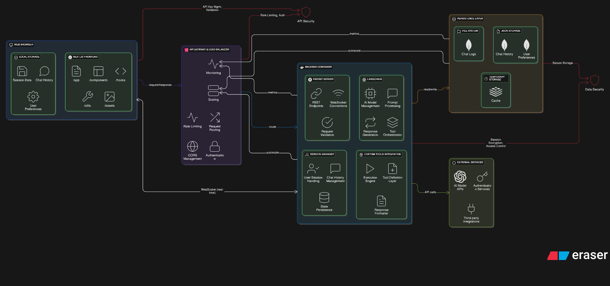

# 🌙 Luna Version X | Next-Gen AI Chat Interface

<div align="center">
  
  <p><em>Luna Version X - Advanced AI Chat Interface with Real-time Tool Integration</em></p>
</div>

## 🌟 Overview

Luna Version X is an enterprise-grade AI chat interface that combines cutting-edge technologies with a beautiful, responsive design. Built with Next.js 15, FastAPI, MongoDB, and LangChain, it offers a sophisticated platform for AI-powered conversations with real-time tool integration and persistent storage.

<div align="center">
  
  <p><em>Robust Data Persistence with MongoDB Atlas Integration</em></p>
</div>

## ✨ Key Features

### Core Capabilities
- 🤖 **Advanced AI Integration** - Powered by Google's Generative AI through LangChain
- 🔄 **Real-time Updates** - WebSocket-based thought process visualization
- 🛠️ **Dynamic Tool System** - Interactive tool authorization and execution
- 💾 **Persistent Storage** - MongoDB Atlas for reliable data management
- 🔐 **Secure Authentication** - NextAuth.js with robust session management

### User Interface
- 🎨 **Modern Design** - Clean, intuitive interface with responsive layouts
- 🌓 **Theme Support** - Light/Dark mode with customizable themes
- 🎬 **Smooth Animations** - GSAP and Framer Motion for fluid transitions
- 📱 **Mobile-First** - Fully responsive across all device sizes

### Technical Features
- 📊 **Real-time Metrics** - Performance monitoring and error tracking
- 🔄 **State Management** - Efficient React hooks and context usage
- 🔗 **Tool Integration** - Extensible system for adding new AI capabilities
- 📡 **WebSocket Support** - Real-time bidirectional communication

## 🚀 Quick Start

### Prerequisites
- Node.js 18+
- Python 3.8+
- MongoDB Atlas Account
- Redis Server
- Google AI API Key

### Environment Setup

1. **Clone the Repository**
```bash
git clone https://github.com/yourusername/luna-version-x.git
cd luna-version-x
```

2. **Frontend Setup**
```bash
cd frontend
npm install
cp .env.example .env.local
# Configure your environment variables
```

3. **Backend Setup**
```bash
cd backend/langgraph
python -m venv venv
source venv/bin/activate  # Windows: venv\Scripts\activate
pip install -r requirements.txt
cp .env.example .env
# Configure your environment variables
```

4. **Database Configuration**
```bash
# Set up MongoDB Atlas
- Create a new cluster
- Configure network access
- Create database user
- Add connection string to .env
```

### Running the Application

1. **Start Backend Services**
```bash
cd backend/langgraph
./run-backend.sh
```

2. **Launch Frontend**
```bash
cd frontend
npm run dev
```

The application will be available at `http://localhost:3000`

## 🏗️ Architecture

### Technology Stack
- **Frontend**: Next.js 15, TypeScript, Tailwind CSS
- **Backend**: FastAPI, LangChain, WebSocket
- **Database**: MongoDB Atlas, Redis
- **Authentication**: NextAuth.js
- **AI Integration**: Google Generative AI, LangChain
- **Animation**: GSAP, Framer Motion, Three.js
- **UI Components**: Radix UI, Custom Components

### System Components
1. **Frontend Layer**
   - Next.js Application
   - Real-time Updates
   - Tool Authorization UI
   - Session Management

2. **Backend Services**
   - FastAPI Server
   - WebSocket Server
   - Authorization Service
   - Tool Management

3. **Database Layer**
   - MongoDB Atlas
     - User Sessions
     - Chat History
     - Metadata Storage
   - Redis
     - Tool Authorization
     - Temporary Storage

## 🔐 Security

- 🔒 **Authentication**: JWT-based with NextAuth.js
- 🛡️ **Data Protection**: End-to-end encryption for sensitive data
- 🔑 **API Security**: Rate limiting and CORS protection
- 🗄️ **Database Security**: MongoDB Atlas security features
- 🚪 **Access Control**: Role-based authorization

## 📊 Monitoring & Logging

- 📈 **Performance Metrics**: Real-time system monitoring
- 🔍 **Error Tracking**: Comprehensive error logging
- 📊 **Analytics**: Usage statistics and patterns
- 🚨 **Alerts**: Automated notification system

## 🛠️ Development

### Adding New Tools
1. Create tool definition in `/backend/langgraph/tools/`
2. Implement authorization flow if required
3. Add frontend UI components
4. Update tool registry

### Custom Themes
1. Define theme variables in `/frontend/styles/themes/`
2. Add theme to theme provider
3. Create theme switcher UI

## 📚 API Documentation

- **REST API**: Available at `/api/docs`
- **WebSocket**: Real-time event documentation
- **Tool API**: Tool integration guidelines

## 🤝 Contributing

1. Fork the repository
2. Create your feature branch
3. Commit your changes
4. Push to the branch
5. Create a Pull Request

Please read [CONTRIBUTING.md](CONTRIBUTING.md) for details on our code of conduct and submission process.

## 📄 License

This project is licensed under the MIT License - see the [LICENSE](LICENSE) file for details.

## 👥 Team

- **Lead Developer**: [Your Name]
- **AI Engineer**: [Name]
- **Frontend Developer**: [Name]
- **Backend Developer**: [Name]
- **DevOps Engineer**: [Name]

## 🙏 Acknowledgments

- Google Generative AI Team
- LangChain Community
- MongoDB Atlas Team
- Next.js Community
- FastAPI Team

## 📞 Support

For support, please:
1. Check the [Documentation](docs/)
2. Search [Issues](issues/)
3. Create a new issue
4. Contact support@lunaversionx.com

---

<div align="center">
  <p>Built with ❤️ by the Luna Version X Team</p>
  <p>Copyright © 2024 Luna Version X. All rights reserved.</p>
</div>